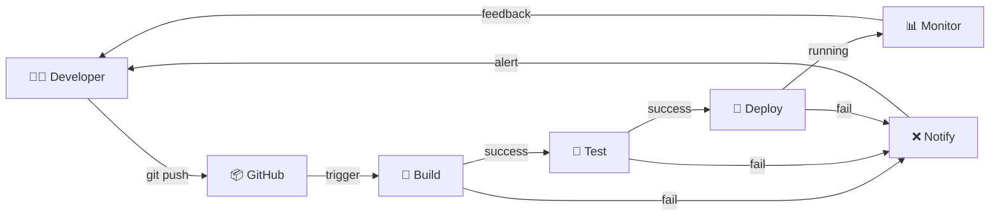
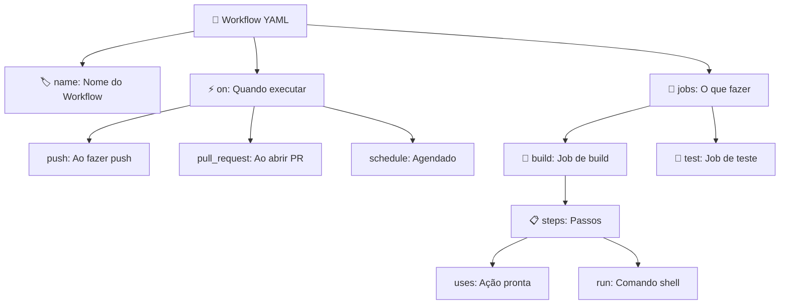

# 🎬 Vídeo 1.1 - Fundamentos de Pipelines e a Linguagem YAML

**Aula**: 1 - Fundamentos CI/CD  
**Vídeo**: 1.1  
**Temas**: Arquitetura CI/CD; Estrutura de Workflow; Sintaxe YAML  
**Tempo**: 25 minutos

---

## 📚 Parte 1: Introdução à Arquitetura CI/CD

### Passo 1: O que é CI/CD?

**CI - Continuous Integration:**
- Integrar código frequentemente no repositório principal
- Testes automáticos a cada commit
- Build automático para validar mudanças
- Feedback rápido sobre problemas

**CD - Continuous Deployment/Delivery:**
- Deploy automático para ambientes
- Ambientes consistentes e reproduzíveis
- Rollback rápido em caso de problemas
- Entrega contínua de valor ao usuário

**Fluxo CI/CD Completo:**



**Ferramentas Populares:**
- **GitHub Actions**: Integrado ao GitHub, baseado em YAML
- **Jenkins**: Open-source, altamente customizável
- **GitLab CI/CD**: Integrado ao GitLab

---

## 🚀 Parte 2: Setup Inicial - Fork do Repositório

### Passo 2: Fork e Clone do Repositório

**Opção A: Fork no GitHub (Recomendado)**

1. Acesse: `https://github.com/josenetoo/fiap-dclt-aula01`
2. Clique em **Fork** (canto superior direito)
3. Selecione sua conta pessoal
4. Aguarde a criação do fork

**Opção B: Clone Direto (para testes rápidos)**

```bash
# Clonar repositório
git clone https://github.com/josenetoo/fiap-dclt-aula01.git
cd fiap-dclt-aula01
```

**Se fez Fork, clone seu repositório:**

```bash
# Clone do SEU fork
git clone https://github.com/SEU-USUARIO/fiap-dclt-aula01.git
cd fiap-dclt-aula01

# Verificar estrutura
ls -la
```

**Estrutura do Projeto:**
```
fiap-dclt-aula01/
├── app/                    # Aplicação Node.js
│   ├── src/
│   ├── tests/
│   └── package.json
├── .github/workflows/      # GitHub Actions (criado no vídeo)
├── Jenkinsfile            # Pipeline Jenkins
├── Dockerfile             # Container da aplicação
```

### Passo 3: Entender e Testar a Aplicação Localmente

**Aplicação: API REST de Todos (Tarefas)**

```bash
# Ver estrutura da aplicação
ls -la app/

# Estrutura:
# app/
# ├── src/
# │   ├── app.js          # API REST (Express.js)
# │   └── server.js       # Servidor HTTP
# ├── tests/
# │   └── app.test.js     # Testes automatizados
# └── package.json        # Dependências Node.js
```

**Endpoints da API:**
- `GET /health` - Health check
- `GET /api/todos` - Listar tarefas
- `POST /api/todos` - Criar tarefa
- `PUT /api/todos/:id` - Atualizar tarefa
- `DELETE /api/todos/:id` - Deletar tarefa
- `GET /api/stats` - Estatísticas

**Testar Aplicação Localmente:**

```bash
# Entrar na pasta da aplicação
cd app

# Instalar dependências
npm install

# Executar testes
npm test

# Resultado esperado:
# PASS  tests/app.test.js
#   ✓ GET /health retorna 200
#   ✓ GET /api/todos retorna array
#   ✓ POST /api/todos cria tarefa
#   ...

# Iniciar aplicação (opcional)
npm start

# Em outro terminal, testar endpoints:
curl http://localhost:3000/health
# {"status":"ok","timestamp":"..."}

curl http://localhost:3000/api/todos
# []

# Parar aplicação: Ctrl+C

# Voltar para raiz do projeto
cd ..
```

> 💡 **Nota:** Vamos criar um pipeline CI/CD que executará esses mesmos testes automaticamente!

---

## Parte 3: Linguagem YAML

### Passo 4: Sintaxe YAML Básica

**YAML** = Yet Another Markup Language

**Regras Importantes:**
- Use **espaços** para indentação (NÃO tabs!)
- Indentação = 2 espaços (padrão)
- Case-sensitive (`Name` ≠ `name`)

**Estrutura de um Workflow CI/CD:**



**Exemplo YAML Detalhado:**

```yaml
# ============================================
# SEÇÃO 1: METADADOS DO WORKFLOW
# ============================================
name: CI Pipeline  # Nome que aparece na UI do GitHub

# ============================================
# SEÇÃO 2: TRIGGERS (QUANDO EXECUTAR)
# ============================================
on:
  push:              # Executa ao fazer push
    branches:        # Apenas nestas branches
      - main
      - develop
  pull_request:      # Executa ao abrir PR
    branches:
      - main
  workflow_dispatch: # Permite execução manual

# ============================================
# SEÇÃO 3: VARIÁVEIS GLOBAIS (OPCIONAL)
# ============================================
env:
  NODE_VERSION: '18'      # Versão do Node.js
  APP_NAME: 'todo-api'    # Nome da aplicação

# ============================================
# SEÇÃO 4: JOBS (O QUE FAZER)
# ============================================
jobs:
  build:                  # ID do job (único)
    name: 🔨 Build        # Nome amigável
    runs-on: ubuntu-latest # Sistema operacional
    
    # ========================================
    # STEPS: SEQUÊNCIA DE AÇÕES
    # ========================================
    steps:
      # Step 1: Baixar código
      - name: Checkout código
        uses: actions/checkout@v4  # Ação do marketplace
      
      # Step 2: Configurar Node.js
      - name: Setup Node.js
        uses: actions/setup-node@v4
        with:                      # Parâmetros da ação
          node-version: ${{ env.NODE_VERSION }}  # Usa variável
          cache: 'npm'             # Cache de dependências
      
      # Step 3: Instalar dependências
      - name: Instalar dependências
        run: npm ci                # Comando shell
        working-directory: app     # Diretório de trabalho
      
      # Step 4: Executar build
      - name: Build aplicação
        run: npm run build
        working-directory: app
```

### Passo 5: Diferença entre `uses` e `run`

**`uses`** = Usa ação pronta do GitHub Marketplace
**`run`** = Executa comando shell customizado

```yaml
steps:
  # uses: Ação reutilizável (alguém já criou)
  - name: Checkout código
    uses: actions/checkout@v4  # ← Ação do marketplace
  
  # run: Comando shell (você escreve)
  - name: Listar arquivos
    run: ls -la  # ← Comando bash
```

---

## ⚙️ Parte 4: Criar Primeiro Workflow GitHub Actions

### Passo 6: Criar Estrutura de Diretórios

```bash
# Criar diretório para workflows
mkdir -p .github/workflows

# Verificar
ls -la .github/workflows/
```

### Passo 7: Criar Workflow Básico

**Criar arquivo: `.github/workflows/ci-basico.yml`**

> 💡 **Nota:** Estamos criando o arquivo direto no local correto (`.github/workflows/`). 
> O GitHub Actions só reconhece workflows nesta pasta específica. Após fazer commit e push, 
> o workflow será executado automaticamente!

**Opção A: Linux/Mac (Terminal)**

```bash
# Criar workflow direto no local correto
cat > .github/workflows/ci-basico.yml << 'EOF'
name: 🚀 CI Básico

# Quando executar este workflow
on:
  push:
    branches: [ main ]
  pull_request:
    branches: [ main ]
  workflow_dispatch:  # Permite execução manual

jobs:
  build-and-test:
    name: 🏗️ Build and Test
    runs-on: ubuntu-latest
    
    steps:
      # Passo 1: Fazer checkout do código
      - name: 📥 Checkout código
        uses: actions/checkout@v4
      
      # Passo 2: Configurar Node.js
      - name: 🔧 Setup Node.js
        uses: actions/setup-node@v4
        with:
          node-version: '18'
          cache: 'npm'
          cache-dependency-path: app/package-lock.json
      
      # Passo 3: Instalar dependências
      - name: 📦 Instalar dependências
        working-directory: app
        run: npm ci
      
      # Passo 4: Executar testes
      - name: 🧪 Executar testes
        working-directory: app
        run: npm test
      
      # Passo 5: Executar lint (análise de código)
      - name: 🔍 Lint
        working-directory: app
        run: npm run lint --if-present
EOF

# Verificar que foi criado corretamente
ls -la .github/workflows/
cat .github/workflows/ci-basico.yml
```

**Opção B: Windows (PowerShell)**

```powershell
# Criar diretório (se não existir)
New-Item -ItemType Directory -Force -Path .github\workflows

# Criar arquivo workflow
@"
name: 🚀 CI Básico

on:
  push:
    branches: [ main ]
  pull_request:
    branches: [ main ]
  workflow_dispatch:

jobs:
  build-and-test:
    name: 🏗️ Build and Test
    runs-on: ubuntu-latest
    
    steps:
      - name: 📥 Checkout código
        uses: actions/checkout@v4
      
      - name: 🔧 Setup Node.js
        uses: actions/setup-node@v4
        with:
          node-version: '18'
          cache: 'npm'
          cache-dependency-path: app/package-lock.json
      
      - name: 📦 Instalar dependências
        working-directory: app
        run: npm ci
      
      - name: 🧪 Executar testes
        working-directory: app
        run: npm test
      
      - name: 🔍 Lint
        working-directory: app
        run: npm run lint --if-present
"@ | Out-File -FilePath .github\workflows\ci-basico.yml -Encoding UTF8

# Verificar que foi criado
Get-Content .github\workflows\ci-basico.yml
```

**Opção C: Qualquer SO (Usar Editor)**

1. Abra VS Code, Notepad++, ou seu editor favorito
2. Crie o arquivo: `.github/workflows/ci-basico.yml`
3. Cole o conteúdo abaixo
4. Salve o arquivo

```yaml
name: 🚀 CI Básico

on:
  push:
    branches: [ main ]
  pull_request:
    branches: [ main ]
  workflow_dispatch:

jobs:
  build-and-test:
    name: 🏗️ Build and Test
    runs-on: ubuntu-latest
    
    steps:
      - name: 📥 Checkout código
        uses: actions/checkout@v4
      
      - name: 🔧 Setup Node.js
        uses: actions/setup-node@v4
        with:
          node-version: '18'
          cache: 'npm'
          cache-dependency-path: app/package-lock.json
      
      - name: 📦 Instalar dependências
        working-directory: app
        run: npm ci
      
      - name: 🧪 Executar testes
        working-directory: app
        run: npm test
      
      - name: 🔍 Lint
        working-directory: app
        run: npm run lint --if-present
```

> 💡 **Recomendação:** Use a **Opção C (Editor)** se tiver dúvidas sobre comandos de terminal!

```

**Explicação Linha por Linha:**

```yaml
name: 🚀 CI Básico
# Nome que aparece na aba Actions do GitHub

on:
  push:
    branches: [ main ]
# Executa quando houver push na branch main

  pull_request:
    branches: [ main ]
# Executa quando houver PR para a branch main

  workflow_dispatch:
# Permite executar manualmente via interface do GitHub

jobs:
# Define os trabalhos (jobs) a executar

  build-and-test:
  # Nome do job (identificador único)
  
    name: 🏗️ Build and Test
    # Nome amigável exibido na UI
    
    runs-on: ubuntu-latest
    # Sistema operacional do runner (máquina virtual)
    
    steps:
    # Lista de passos a executar
    
      - name: 📥 Checkout código
        uses: actions/checkout@v4
        # Ação do marketplace que clona o repositório
      
      - name: 🔧 Setup Node.js
        uses: actions/setup-node@v4
        # Ação que instala Node.js
        with:
          node-version: '18'
          # Parâmetro: versão do Node.js
          cache: 'npm'
          # Habilita cache de dependências npm
      
      - name: 📦 Instalar dependências
        working-directory: app
        # Executa comando no diretório app/
        run: npm ci
        # Comando: instala dependências (mais rápido que npm install)
      
      - name: 🧪 Executar testes
        working-directory: app
        run: npm test
        # Comando: executa testes automatizados
```

---

## 🔄 Parte 5: Executar e Testar o Workflow

### Passo 8: Commit e Push do Workflow

```bash
# Verificar status
git status

# Adicionar workflow
git add .github/workflows/ci-basico.yml

# Commit
git commit -m "feat: adicionar workflow CI básico com YAML"

# Push para GitHub (seu fork)
git push origin main
```

### Passo 9: Acompanhar Execução no GitHub

**No GitHub (seu fork):**

1. Acesse seu repositório: `https://github.com/SEU-USUARIO/fiap-dclt-aula01`
2. Clique na aba **Actions** (no topo)
3. Veja o workflow "🚀 CI Básico" em execução
4. Clique no workflow para ver detalhes
5. Clique no job "🏗️ Build and Test"
6. Expanda cada step para ver os logs

**Resultado Esperado:**
```
✅ Set up job
✅ 📥 Checkout código
✅ 🔧 Setup Node.js
✅ 📦 Instalar dependências
✅ 🧪 Executar testes
✅ 🔍 Lint
✅ Post Setup Node.js
✅ Complete job
```

**Tempo de Execução:** ~1-2 minutos

### Passo 10: Executar Manualmente (Opcional)

**Se quiser testar sem fazer push:**

1. Na aba **Actions**
2. Clique em "🚀 CI Básico" (na lista à esquerda)
3. Clique em "Run workflow" (botão à direita)
4. Selecione a branch (main)
5. Clique em "Run workflow"

**Por que isso funciona?**
```yaml
on:
  workflow_dispatch:  # ← Permite execução manual
```

---

**FIM DO VÍDEO 1.1** ✅
