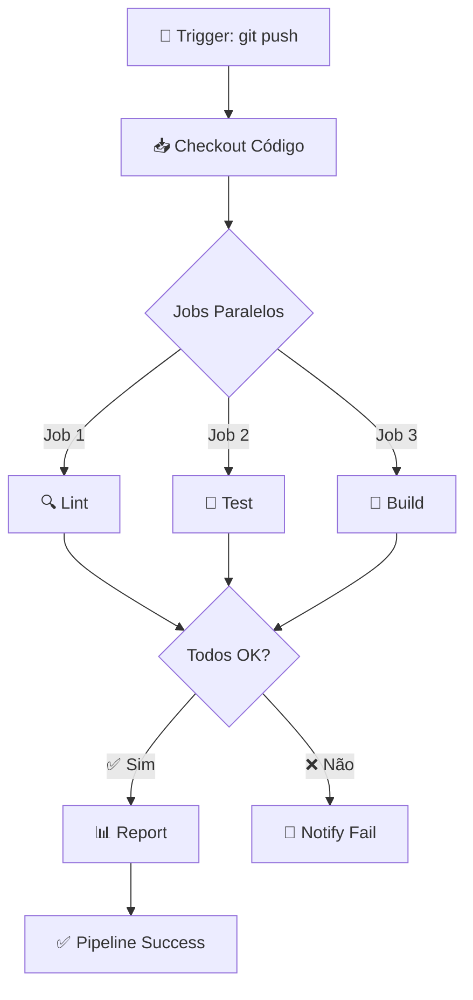

# 🎬 Vídeo 1.2 - Criando o Primeiro Pipeline de CI

**Aula**: 1 - Fundamentos CI/CD  
**Vídeo**: 1.2  
**Temas**: Pipeline CI; Build; Testes; Análise de Logs  
**Tempo**: 20 minutos

---

## 📚 Parte 1: Conceitos de Pipeline de CI

### Passo 1: O que é um Pipeline de CI?

**Pipeline de CI** = Sequência automatizada de etapas para validar código

**Arquitetura de Pipeline com Múltiplos Jobs:**



**Benefícios:**
- ✅ Detectar bugs cedo
- ✅ Feedback rápido (jobs paralelos)
- ✅ Prevenir regressões

---

## 🏗️ Parte 2: Expandir Pipeline com Múltiplos Jobs

### Passo 2: Criar Pipeline Completo

**Criar arquivo: `.github/workflows/ci-completo.yml`**

> 💡 **Nota:** Criamos o workflow direto em `.github/workflows/` para que o GitHub Actions 
> reconheça e execute automaticamente após o push. Não é necessário criar em pasta temporária!

**Opção A: Linux/Mac (Terminal)**

```bash
# Criar pipeline completo
cat > .github/workflows/ci-completo.yml << 'EOF'
name: 🚀 CI Completo

on:
  push:
    branches: [ main, develop ]
  pull_request:
    branches: [ main ]
  workflow_dispatch:

env:
  NODE_VERSION: '18'

jobs:
  # Job 1: Lint e Análise de Código
  lint:
    name: 🔍 Lint e Análise
    runs-on: ubuntu-latest
    
    steps:
      - name: 📥 Checkout
        uses: actions/checkout@v4
      
      - name: 🔧 Setup Node.js
        uses: actions/setup-node@v4
        with:
          node-version: ${{ env.NODE_VERSION }}
          cache: 'npm'
          cache-dependency-path: app/package-lock.json
      
      - name: 📦 Instalar dependências
        working-directory: app
        run: npm ci
      
      - name: 🔍 Executar ESLint
        working-directory: app
        run: npm run lint --if-present
        continue-on-error: true
  
  # Job 2: Testes Unitários
  test:
    name: 🧪 Testes Unitários
    runs-on: ubuntu-latest
    needs: lint  # Executa após lint
    
    steps:
      - name: 📥 Checkout
        uses: actions/checkout@v4
      
      - name: 🔧 Setup Node.js
        uses: actions/setup-node@v4
        with:
          node-version: ${{ env.NODE_VERSION }}
          cache: 'npm'
          cache-dependency-path: app/package-lock.json
      
      - name: 📦 Instalar dependências
        working-directory: app
        run: npm ci
      
      - name: 🧪 Executar testes
        working-directory: app
        run: npm test -- --coverage
      
      - name: 📊 Upload coverage
        uses: actions/upload-artifact@v4
        with:
          name: coverage-report
          path: app/coverage/
          retention-days: 7
  
  # Job 3: Build
  build:
    name: 🏗️ Build
    runs-on: ubuntu-latest
    needs: test  # Executa após testes
    
    steps:
      - name: 📥 Checkout
        uses: actions/checkout@v4
      
      - name: 🔧 Setup Node.js
        uses: actions/setup-node@v4
        with:
          node-version: ${{ env.NODE_VERSION }}
          cache: 'npm'
          cache-dependency-path: app/package-lock.json
      
      - name: 📦 Instalar dependências
        working-directory: app
        run: npm ci
      
      - name: 🏗️ Build aplicação
        working-directory: app
        run: |
          echo "Building application..."
          # Aqui seria npm run build para apps React, etc
          echo "✅ Build completed!"
      
      - name: 📊 Build Summary
        run: |
          echo "## 🏗️ Build Summary" >> $GITHUB_STEP_SUMMARY
          echo "" >> $GITHUB_STEP_SUMMARY
          echo "**Node Version**: ${{ env.NODE_VERSION }}" >> $GITHUB_STEP_SUMMARY
          echo "**Status**: ✅ Success" >> $GITHUB_STEP_SUMMARY
EOF

# Commit
git add .github/workflows/ci-completo.yml
git commit -m "feat: adicionar pipeline CI completo"
git push origin main
```

**Opção B: Windows (PowerShell) ou Opção C: Editor**

> 💡 **Para Windows:** Use o mesmo conteúdo YAML acima, mas crie o arquivo via:
> - **PowerShell:** Similar à Opção A do Vídeo 1.1, use `@"..."@ | Out-File`
> - **Editor:** Crie o arquivo `.github/workflows/ci-completo.yml` manualmente no VS Code

### Passo 3: Entender Dependências entre Jobs

**Visualização do Pipeline:**

```
┌─────────┐
│  Lint   │
└────┬────┘
     │
     ▼
┌─────────┐
│  Test   │
└────┬────┘
     │
     ▼
┌─────────┐
│  Build  │
└─────────┘
```

**Conceito `needs`:**
```yaml
jobs:
  job-a:
    runs-on: ubuntu-latest
    steps: [...]
  
  job-b:
    needs: job-a  # Só executa se job-a passar
    runs-on: ubuntu-latest
    steps: [...]
```

---

## 📊 Parte 3: Análise de Logs e Debugging

### Passo 4: Acompanhar Execução Detalhada

**No GitHub Actions:**

1. Acesse: **Actions** → **🚀 CI Completo**
2. Clique no workflow em execução
3. Observe a visualização gráfica dos jobs

**Análise de Cada Job:**

**Job 1: Lint**
```
✅ Set up job (2s)
✅ 📥 Checkout (1s)
✅ 🔧 Setup Node.js (3s)
✅ 📦 Instalar dependências (15s)
✅ 🔍 Executar ESLint (2s)
✅ Complete job (1s)
```

**Job 2: Test**
```
✅ Set up job (2s)
✅ 📥 Checkout (1s)
✅ 🔧 Setup Node.js (1s) ← Cache hit!
✅ 📦 Instalar dependências (8s) ← Cache hit!
✅ 🧪 Executar testes (5s)
✅ 📊 Upload coverage (2s)
✅ Complete job (1s)
```

**Job 3: Build**
```
✅ Set up job (2s)
✅ 📥 Checkout (1s)
✅ 🔧 Setup Node.js (1s)
✅ 📦 Instalar dependências (8s)
✅ 🏗️ Build aplicação (3s)
✅ 📊 Build Summary (1s)
✅ Complete job (1s)
```

### Passo 5: Interpretar Logs de Erro

**Simular Erro: Teste Falhando**

```bash
# Adicionar teste que falha
cat >> app/tests/app.test.js << 'EOF'

describe('Pipeline Error Test', () => {
  it('should fail to demonstrate error handling', () => {
    expect(1 + 1).toBe(3); // Vai falhar!
  });
});
EOF

# Commit
git add app/tests/app.test.js
git commit -m "test: adicionar teste que falha"
git push origin main
```

**Analisar Falha no GitHub:**

1. Actions → Ver workflow falhado (❌)
2. Clicar no job "🧪 Testes Unitários"
3. Expandir step "🧪 Executar testes"

**Log de Erro Esperado:**
```
FAIL tests/app.test.js
  Pipeline Error Test
    ✕ should fail to demonstrate error handling (5ms)

  ● Pipeline Error Test › should fail to demonstrate error handling

    expect(received).toBe(expected) // Object.is equality

    Expected: 3
    Received: 2

      2 |   it('should fail to demonstrate error handling', () => {
      3 |     expect(1 + 1).toBe(3); // Vai falhar!
        |                    ^
      4 |   });

Test Suites: 1 failed, 0 passed, 1 total
Tests:       1 failed, 5 passed, 6 total

Error: Process completed with exit code 1.
```

**Entendendo o Erro:**
- ❌ Linha exata do erro
- ❌ Valor esperado vs recebido
- ❌ Stack trace
- ❌ Exit code (1 = erro)

### Passo 6: Corrigir e Reexecutar

```bash
# Reverter commit com erro
git revert HEAD --no-edit
git push origin main

# Ver pipeline passar novamente ✅
```

---

## 🎯 Parte 4: Otimizações de Pipeline

### Passo 7: Adicionar Cache e Paralelização

**Otimização 1: Jobs Paralelos**

```yaml
jobs:
  lint:
    runs-on: ubuntu-latest
    # Não tem 'needs', executa em paralelo
  
  test:
    runs-on: ubuntu-latest
    # Não tem 'needs', executa em paralelo
  
  build:
    needs: [lint, test]  # Espera AMBOS
    runs-on: ubuntu-latest
```

**Visualização Paralela:**
```
┌─────────┐
│  Lint   │ ─┐
└─────────┘  │
             ├──▶ ┌─────────┐
┌─────────┐  │    │  Build  │
│  Test   │ ─┘    └─────────┘
└─────────┘
```

**Otimização 2: Matrix Strategy (Múltiplas Versões)**

```yaml
jobs:
  test:
    runs-on: ubuntu-latest
    strategy:
      matrix:
        node-version: [16, 18, 20]
    
    steps:
      - uses: actions/checkout@v4
      - uses: actions/setup-node@v4
        with:
          node-version: ${{ matrix.node-version }}
      - run: npm ci
      - run: npm test
```

**Resultado:** Testa em 3 versões do Node simultaneamente!

---

**FIM DO VÍDEO 1.2** ✅